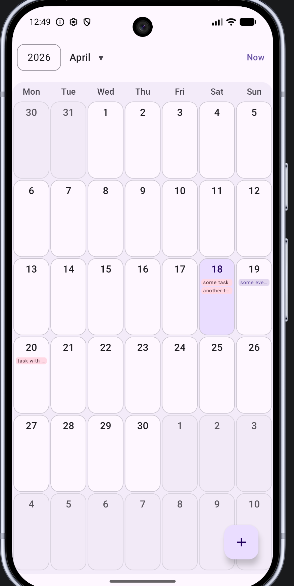
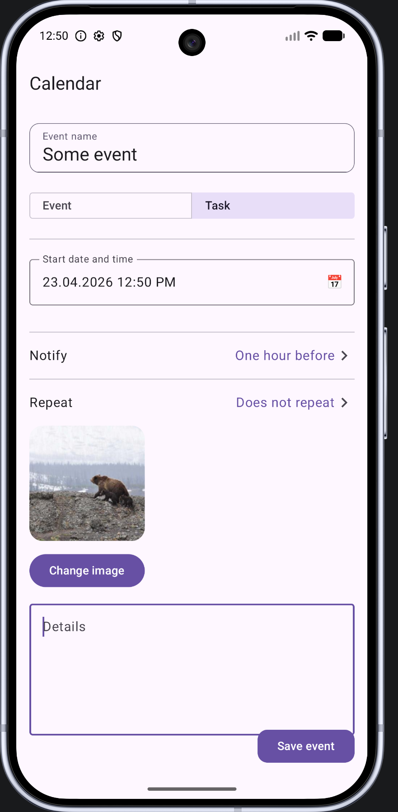
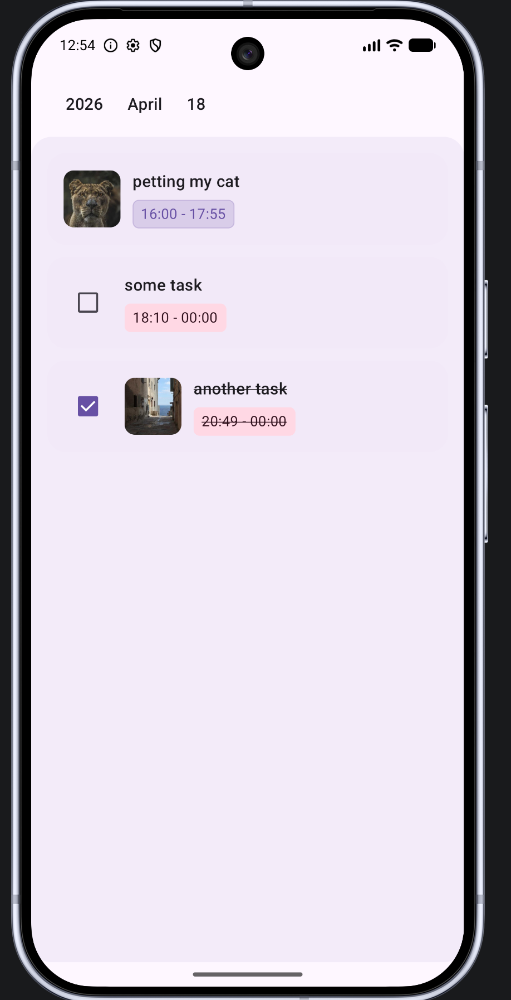

# Домашнее задание - проектная работа "Календарь"

Приложение позволяет создавать задачи и события, добавлять к ним напоминания, завершать их
- задачу можно добавить уведомление и выполнить задачу
- событие можно добавить напоминание, событие выполнить нельзя

## Состоит из трех экранов:

### Основной экран

- позволяет просматривать события за месяц
- переходить на экран создания новых событий

### Экран создания события

позволяет

- создать событие или задачу
- добавить дату начала для задачи и дату начала и окончания для события
- добавить уведомление
- добавить картинку
- добавить краткое описание

### Экран просмотра событий на день

позволяет

- просматривать события и задачи на день
- возможность завершать задачи
- возможность переходить к экрану создания по клику на событие и редактировать его